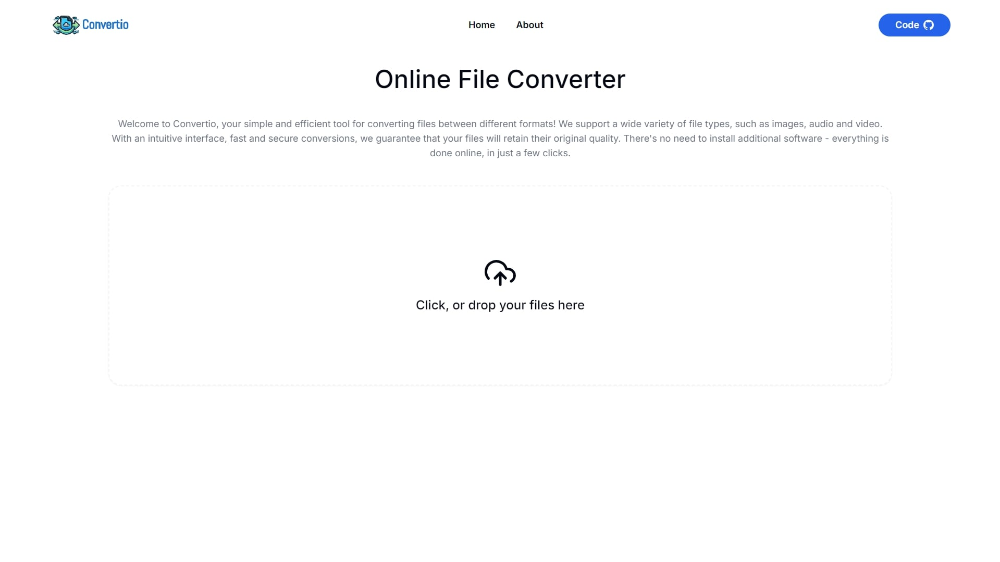

<!-- Improved compatibility of back to top link: See: https://github.com/othneildrew/Best-README-Template/pull/73 -->

<!--
*** Thanks for checking out the Best-README-Template. If you have a suggestion
*** that would make this better, please fork the repo and create a pull request
*** or simply open an issue with the tag "enhancement".
*** Don't forget to give the project a star!
*** Thanks again! Now go create something AMAZING! :D
-->

<!-- PROJECT LOGO -->

  <h3 align="center">Convertio</h3>

  

    A powerful media converter for photos, videos and audio
  

<!-- TABLE OF CONTENTS -->

  
Table of Contents

  <ol>
    <li>
      <a href="#about-the-project">About The Project</a>
      <ul>
        <li><a href="#built-with">Built With</a></li>
      </ul>
    </li>
    <li><a href="#usage">Usage</a></li>
    <li><a href="#contact">Contact</a></li>
    <li><a href="#acknowledgments">Acknowledgments</a></li>
  </ol>

<!-- ABOUT THE PROJECT -->
## About The Project

 

  

 

Convertio is a versatile media conversion tool designed to handle photos, videos, and audio files. It provides a seamless user experience for converting media formats with high efficiency. The project takes advantage of the power of FFmpeg and WebAssembly (Wasm) to process files directly in the browser without the need for server-side processing, ensuring privacy and speed.

Here’s what Convertio offers:

* Fast and efficient conversion of images, videos, and audio formats.
* Cross-platform support using modern web technologies, making it accessible from any device.
* High-performance media processing with FFmpeg running via WebAssembly, allowing conversions directly in your browser.

If you’re looking to convert files for personal use, Convertio is built to meet those needs.

(<a href="#readme-top">back to top</a>)

### Built With

This converter was built using the following technologies:

* [![React][React.js]][React-url]
* [![NextJS][NextJS]][NextJS-url]
* [![FFmpeg][FFmpeg]][FFmpeg-url]
* [![Tailwind CSS][Tailwind CSS]][Tailwind CSS-url]
* [![GitHub Pages][GitHub Pages]][GitHub Pages-url]

(<a href="#readme-top">back to top</a>)

<!-- USAGE EXAMPLES -->
## Usage

You can use Convertio to easily convert your media files by visiting the following link: [https://tiagoribeiro2001.github.io/convertio/](https://tiagoribeiro2001.github.io/convertio/)

Simply upload a photo, video, or audio file, choose the output format, and let Convertio handle the rest. The conversion is fast and secure, with all processing done locally on your device through WebAssembly, ensuring that no data is sent to external servers.

(<a href="#readme-top">back to top</a>)

<!-- CONTACT -->
## Contact

Tiago Ribeiro - ribeiro.tiago2001@gmail.com

Project Link: [https://tiagoribeiro2001.github.io/convertio/](https://tiagoribeiro2001.github.io/convertio/)

(<a href="#readme-top">back to top</a>)

<!-- ACKNOWLEDGMENTS -->
## Acknowledgments

* [Online File Converter](https://github.com/benlhachemi/modifio)

(<a href="#readme-top">back to top</a>)

<!-- MARKDOWN LINKS & IMAGES -->
<!-- https://www.markdownguide.org/basic-syntax/#reference-style-links -->

[React.js]: https://img.shields.io/badge/React-20232A?style=for-the-badge&logo=react&logoColor=61DAFB
[React-url]: https://reactjs.org/
[NextJS]: https://img.shields.io/badge/Next-black?style=for-the-badge&logo=next.js&logoColor=white
[NextJS-url]: https://nextjs.org/
[FFmpeg]: https://shields.io/badge/FFmpeg-%23171717.svg?logo=ffmpeg&style=for-the-badge&labelColor=171717&logoColor=5cb85c
[FFmpeg-url]: https://ffmpegwasm.netlify.app/
[Tailwind CSS]: https://img.shields.io/badge/tailwindcss-%2338B2AC.svg?style=for-the-badge&logo=tailwind-css&logoColor=white
[Tailwind CSS-url]: https://tailwindcss.com/
[GitHub Pages]: https://img.shields.io/badge/github%20pages-121013?style=for-the-badge&logo=github&logoColor=white
[GitHub Pages-url]: https://pages.github.com/
